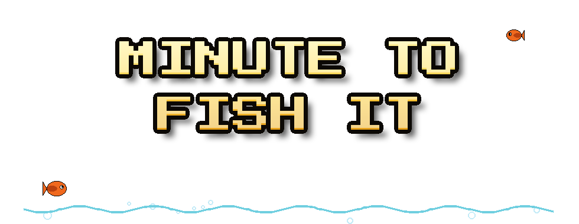

**Drag to aim your speargun, spear fish, reel them in for cash — you've got 60 seconds.**

## About

Minute to Fish It is a 2D arcade score-attack game built in Godot 4. Pilot a little submarine, spear as many fish as you can before the clock runs out, and watch out for bomb fish — they'll end your run instantly. Chase golden fish for the jackpot, dart fish for a quick bonus, and beat your best score.

## How to play

- **Drag** anywhere on screen and release to aim & fire your speargun
- Or use **arrow keys** to aim, **Up/Down** for power, **Space** to fire
- Reel in fish for cash — bigger and rarer fish pay more
- Golden fish are the jackpot; fast fish dart away quickly
- Bomb fish end your run instantly — don't spear them!
- Press **R** to restart a run (press it twice to confirm)
- Press **Esc** to return to the title screen
- Press **F1** anytime to see the instructions again

## Concept art

| | |
|---|---|
|  |  |
|  |  |
|  |  |

## Running it

1. Open the project folder in [Godot 4.7](https://godotengine.org/) (or newer).
2. Press **F5** (or the Play button) — `scenes/Main.tscn` is set as the main scene.

## Built with

- [Godot Engine](https://godotengine.org/) 4.7 (GL Compatibility renderer)
- GDScript
- [Press Start 2P](https://fonts.google.com/specimen/Press+Start+2P) and [VT323](https://fonts.google.com/specimen/VT323) (SIL Open Font License)
